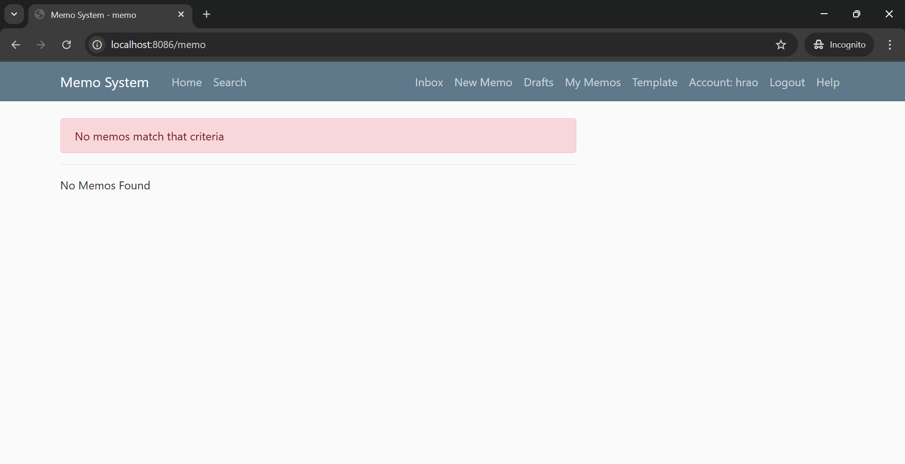

# Memo System Install README

This document explains how to install and run the Memo System application on your machine.

## Prerequisites

-   Docker installed on your machine.
-   Git installed on your machine.
-   Use Git bash terminal to execute below commands in windows

## Installation

1.  Clone the Memo System repository from Github.
 
    `git clone https://github.com/completesolar/memosystem.git` 
    
2.  Navigate into the cloned repository.
        
    `cd memosystem` 
    
3.  Create the directory for storing memos and memo meta data.
     
    `mkdir -p memo_files/static/config memo_files/mysql memo_files/sqlite`
    
4.  Copy `memos/settings_local.py` to the new `config` directory.
    
    `cp memos/settings_local.py memo_files/static/config/settings_local.py`

5.  Copy `memos/memos/template_static_files` content to the `memo_files/static`

    `cp -r memos/memos/template_static_files/* memo_files/static/`

6. Copy `docker-compose.yml.template` content to `docker-compose.yml` and update secrets, paths etc
    
    `cp docker-compose.yml.template docker-compose.yml`    

7. Run the following command to build and start the containers:
    
    `docker-compose up -d` 
    
8. Verify that the containers are running with the following command:
    
    `docker-compose ps` 
    
    This should show a list of running containers including `memosystem` and `mysql`.
    
9. This command needs to be executed through powershell on windows
    Once the containers are up and running, create the database tables by running the following command:
 
    `cat memos/db_dump.sql | docker exec -i mysql /usr/bin/mysql -h localhost -u memosystem --password=memopw memos` 
    
10. Access the Memo System application by navigating to [http://localhost:8086](http://localhost:8086) in your web browser.

11. Screenshot shows how UI will look once loggedin using microsoft sso login
    

12. You can connect to database through mysql workbench using below details
    Hostname: localhost
    Port: 3306
    Username: memosystem
    Password: memopw    

## Notes

-   When the system is running it will need to store the memos and memo meta data onto a permanent file system on the host. The docker compose will need to "mount" the local file system into the docker containers. In my installation I created a directory at the top level called "memo_files". In this directory, I make three subdirectories, one for the files (static), one for the MySQL, and one for the SQLite. You should create these directories and update the `docker-compose.yml` file with the correct paths to these directories on your machine.
-   The `docker-compose.yml` paths need to be adapted to the local filesystem. The current paths are set up for the author's local file system.
-   If you encounter any issues, please refer to the official Docker and Docker Compose documentation.
-   Find the original documentation here [IoT Expert](https://github.com/iotexpert/memosystem).